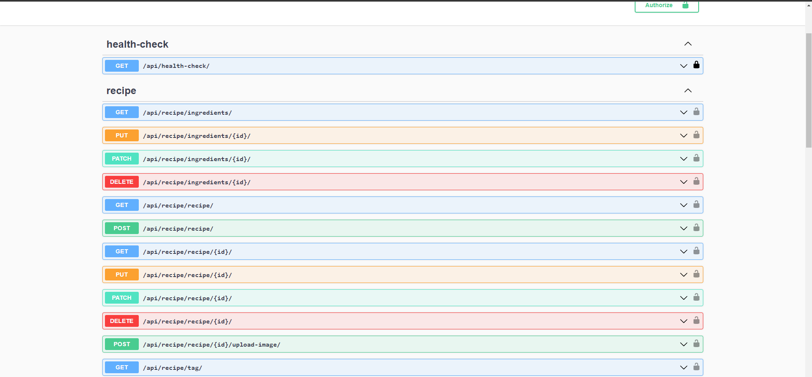

<h3>About</h3>

In this section, l have built a backend REST API using Python, Django, Django REST Framework, Docker, GitHub Actions, Postgres and Test Driven Development(TDD).

---

**This REST API can handle**:

- User authentication
- Creating objects
- Filtering and sorting objects
- Adding and viewing image

---

During development, l have gained new knowledge about TDD and smth about docker, also
I configured Swagger for browsing my APIs.

---

### Demo

Swagger endpoints

